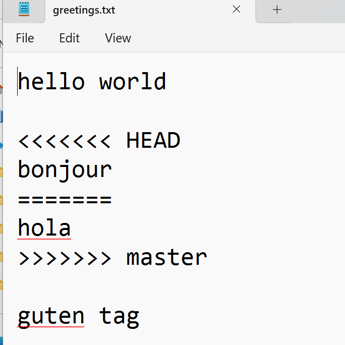

# 🐙 Git & GitHub Workshop - Part 1: Working with a Local Repo

---

## Introduction: Why do Developers use Git & GitHub?

<image src="images/version-control-can-anyone-relate-v5.webp" width="500px" />

Has anyone worked on a collaborative document before?  
This is much better than sending versions back and forth - but there are still problems. What would happen if we managed our codebase in, say, Google Drive?

We can think of Git & GitHub in two parts:

| Part | What it does                                                                                   |
|---|------------------------------------------------------------------------------------------------|
| **Git** | Version control - tracks changes to files and manages different versions of your codebase      |
| **GitHub** | Collaboration - a platform for sharing changes, reviewing contributions, and working as a team |

---

## Section 1 - Initialise a Git Repo

### Step 1 - Configure Git

You need to tell Git who you are. Run these commands once when setting up a new machine:

```
git config --global user.name "your name"
git config --global user.email "any@email.com"
git config --global core.editor notepad
```

> 💡 The `--global` flag means these settings apply to every Git repo on your machine, not just one project.

---

### Step 2 - Create an empty folder called `git_practice`

**OPTIONAL:** create in the command line:

```
mkdir git_practice
cd git_practice
```

Open a git terminal inside the `git_practice` folder and confirm you are in the right place:

```
pwd
```

View the files inside your current directory:

```
ls
```

View any hidden files:

```
ls -a
```

At this point, `git_practice` is just a regular empty folder - no Git involved yet.

---

### Step 3 - Run our first Git command

Always run `git status` **before** `git init`. This tells you whether you are already inside a Git repo (which could cause problems if you accidentally nest repos).

```
git status
```

You should see:

> fatal: not a git repository (or any of the parent directories): .git

✅ That's expected - it confirms we are not inside a Git repo yet.

---

### Step 4 - Initialise a Git repository

```
git init
```

Check the status again:

```
git status
```

You should see:

> On branch master  
> No commits yet  
> nothing to commit (create/copy files and use "git add" to track)

---

### What is `git_practice` now?

- It was just a folder/directory on your machine
- It is now **Git tracked**
- You can call it the `working directory` or `local repository (local repo)`
- Any changes made inside `git_practice` are now tracked by Git

<image src="images/image-1.png" width="500px" />

---

## Section 2 - Stage and Commit Changes

### Step 1 - Stage a change (file added)

Create a new file inside `git_practice` called **greetings.txt**, then run `ls` to confirm it's there:

```
ls
```

<image src="images/image-2.png" width="500px" />

Now that `git_practice` is a Git repository, its contents are being tracked:

<image src="images/image-16.png" width="500px" />

---

### What is an Untracked File?

Check the status of the repository:

```
git status
```

You'll see `greetings.txt` listed as **untracked**:

<image src="images/image-4.png" width="500px" />

> 💡 An **untracked file** exists in your working directory but Git is not yet recording changes to it. You need to explicitly tell Git to start tracking it.

Add `greetings.txt` to the staging area:

```
git add greetings.txt
git status
```

<image src="images/image-5.png" width="500px" />

---

### What is the Staging Area?

The **staging area** is a space where you organise and review changes before committing them. It gives you control over exactly what goes into your next commit - you can stage some files but not others.

> 💡 `git add` adds **changes** to the staging area - this includes new files, modifications, and deletions.

---

### Step 2 - Commit your changes

```
git commit -m "initial commit, empty greetings text file created"
```

---

### Step 3 - Make a modification and check the status

<image src="images/image-3.png" width="500px" />

When you modify a tracked file, Git knows about it. Running `git status` will show the changes as **not yet staged for commit** - meaning you haven't run `git add` yet.

```
git status
```

Leave these changes unstaged for now.

---

### 🏆 End of Section 2 Challenge

- Create a new file in `git_practice` called **goodbyes.txt**
- Add the word for "goodbye" in a language of your choice
- Stage **all** changes at once using `.` (this stages both the new file and any unstaged modifications to `greetings.txt`):

```
git add .
```

- Check the status to confirm what has been staged
- Commit with a suitable message

---

## Section 3 - Branching

A **branch** is a separate timeline of commits, starting from a common point and diverging. Branches let developers work on different features or fixes independently without affecting each other's work.

Check which branch you are currently on:

```
git branch
```

Create a new branch called `colors`:

```
git branch colors
```

> 💡 Creating a branch does **not** switch you to it automatically. Any commits you make now will still go to your current branch.

<image src="images/image-7.png" width="500px" />

Switch to the `colors` branch:

```
git checkout colors
git branch
```

---

### Step 1 - Make a commit to the `colors` branch

Create a new file called **somecolors.txt** and add some text to it.

<image src="images/image-8.png" width="500px" />

Stage and commit the changes, then use `ls` to see the files present:

> greetings.txt &nbsp; goodbyes.txt &nbsp; somecolors.txt

Now switch back to `master` and view the files again:

```
git checkout master
ls
```

> 💡 `somecolors.txt` won't appear here - it only exists on the `colors` branch. This is the power of branching: changes are isolated until you choose to merge them.

> greetings.txt &nbsp; goodbyes.txt

---

### 🏆 End of Section 3 Challenge

- Create a new branch called `cities`
- Switch to it using `git checkout`
- Use `git branch` to confirm you're on the right branch
- Create a file called **somecities.txt** and add some city names
- Stage and commit the changes from the `cities` branch

---

## Section 4 - Introducing Merging

A **Git merge** combines changes from one branch into another. It allows developers to consolidate work from different lines of development into a single unified codebase.

Assuming you are on `master`, merge the `colors` branch in:

```
git merge colors
```

> 💡 You always merge **into** the branch you are currently on. Make sure you are on `master` before running this.

Confirm `somecolors.txt` now appears in `master`:

```
ls
```

The `colors` branch has done its job and can now be deleted:

```
git branch -d colors
```

---

### 🏆 End of Section 4 Challenge

Merge your `cities` branch into `master`.

You should see that `master` now has 4 text files: `greetings`, `goodbyes`, `somecolors`, and `somecities`.

Once merged, delete the `cities` branch.

---

## Section 5 - Merge Conflicts

### What is a Merge Conflict?

Merge conflicts happen when **two branches have made different changes to the same part of the same file**, and Git can't automatically decide which version to keep. You have to step in and resolve it manually.

---

### Step 1 - Set up the conflict

Confirm you are on `master`:

```
git branch
```

Create a new branch called `french` but **stay on master** - do not switch to it yet:

```
git branch french
```

Edit `greetings.txt` on `master` to contain:

> hello world  
> hola  
> guten tag

Stage and commit to `master`:

```
git add .
git commit -m "said hello in english, spanish and german"
```

---

### Step 2 - Make a conflicting change on `french`

Switch to the `french` branch and change the same line differently:

```
git checkout french
```

Edit `greetings.txt` to contain:

> hello world  
> bonjour  
> guten tag

Stage and commit:

```
git add .
git commit -m "Said hello in french instead of spanish"
```

---

### Step 3 - Trigger the merge conflict

Switch back to `master` and attempt the merge:

```
git checkout master
git merge french
```

<image src="images/image-14.png" width="500px" />

---

### Step 4 - Resolve the conflict

```
git status
```

<image src="images/image-15.png" width="500px" />

Open `greetings.txt` - Git will have added annotations showing both versions of the conflicting lines:



> 💡 Git marks conflicts with `<<<<<<<`, `=======`, and `>>>>>>>`. The section above `=======` is one version, and the section below is the other version. You choose which content to keep (or combine both).

Manually edit the file to the version you want (keep one, keep both, or write something new). Then tell Git the conflict is resolved:

```
git add greetings.txt
git commit -m "Resolve merge conflict in greetings.txt"
```

Conflict resolved - branches merged. ✅

<image src="images/image-17.png" width="500px" />
