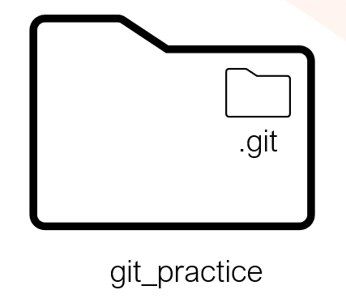
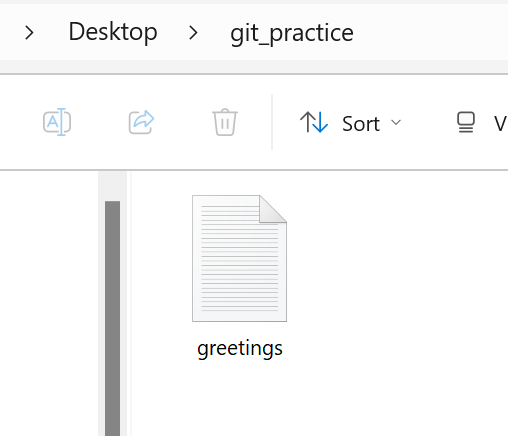
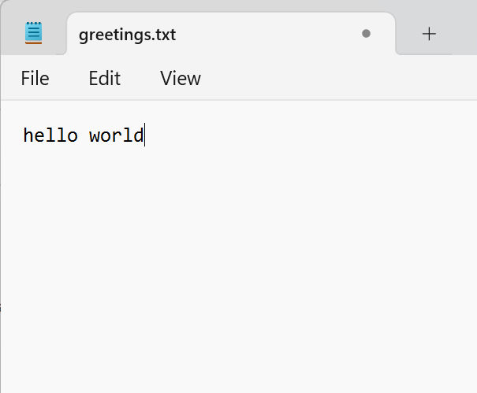
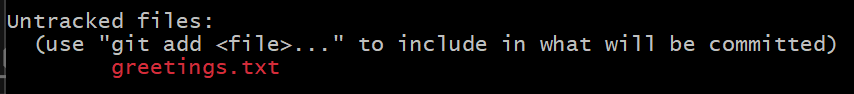

## git status

```
mkdir git_practice
cd git_practice
pwd
Ls
ls -a
```

We have created a new, empty directory called git_practice.

```
git status

```

You should a message like:

```
fatal: not a git repository (or any of the parent directories): .git
```

This means we are not inside a git repository. git_practise is just a regular directory/folder. It has no git repository (yet)

## git init

Initialise a git repository to track the files in the git_practice folder

```
git init
```

Check the status again

```
Git status
```

You will see a response like

```

On branch master

No commits yet

nothing to commit (create/copy files and use "git add" to track)

```

### What is git_practice?

- It was just a folder/directory on your machine

- It is now git tracked

- You can call it the `working directory` or `local repository (local repo)`

- Changes you make inside git_practise folder are tracked by git



### Create a new file inside git_practice called greetings.txt

```
touch greetings.txt
ls
```

You shouldsee that git_practice folder now contains a plain text file called greetings.txt



### Type your first greeting in greetings.txt



### What is an untracked file?

In your terminal, check the status of the git repository

```
git status

```

You should see the status of your repository, which will include your greetings.txt file showing up as "untracked"



In Git, an untracked file is a file that exists in your working directory but is not yet part of your repository. This means Git is not tracking changes to it.

## git add

To start tracking greetings.txt, you use the `git add` command, which stages the file, preparing it to be included in the next commit.

```
git add greetings.txt
git status
```

File is added to the staging area.


### What is the Staging Area?

The staging area in Git is a space where you can organize and review changes before committing them to the repository. It allows you to selectively stage specific changes, providing greater control over what gets included in your next commit.

## git commit

```
git commit -m "initial commit, added some text into greetings"

```
