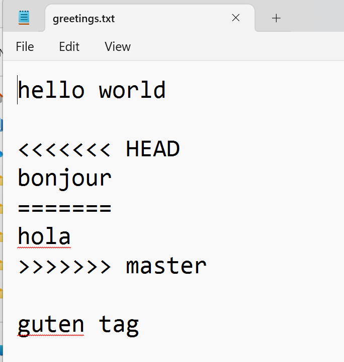

## git status

```
mkdir git_practice
cd git_practice
pwd
Ls
ls -a
```

We have created a new, empty directory called git_practice.

```
git status

```

You should a message like:

```
fatal: not a git repository (or any of the parent directories): .git
```

This means we are not inside a git repository. git_practise is just a regular directory/folder. It has no git repository (yet)

## git init

Initialise a git repository to track the files in the git_practice folder

```
git init
```

Check the status again

```
Git status
```

You will see a response like

```

On branch master

No commits yet

nothing to commit (create/copy files and use "git add" to track)

```

## What is git_practice?

- It was just a folder/directory on your machine

- It is now git tracked

- You can call it the working directory or local repository (local repo)

- Changes you make inside git_practise folder are tracked by git


