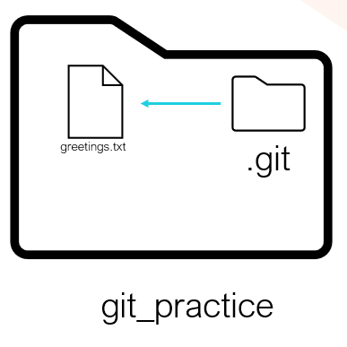
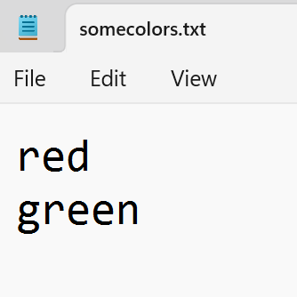
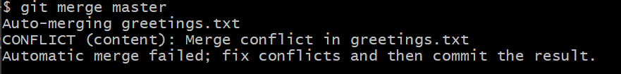
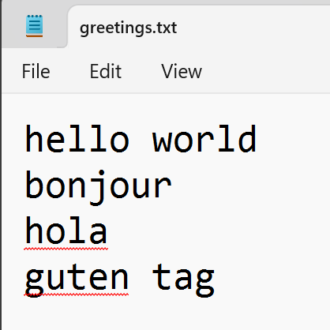

# Section 1 - Initialise a git repo

### Create an empty folder called git_practice

```
mkdir git_practice
cd git_practice
pwd
ls
ls -a
```

We have created a new, empty directory called git_practice.

Run the git status command

```
git status
```

You should a message like:

> fatal: not a git repository (or any of the parent directories): .git

This means we are not inside a git repository. git_practise is just a regular directory/folder. It has no git repository (yet)

### Initialise a git repository to track the files in the git_practice folder

```
git init
```

Check the status again

```
git status
```

You will see a response like

> On branch master

> No commits yet

> nothing to commit (create/copy files and use "git add" to track)

<br>

### What is git_practice?

- It was just a folder/directory on your machine

- It is now git tracked

- You can call it the `working directory` or `local repository (local repo)`

- Changes you make inside git_practise folder are tracked by git

<image src="images/image-1.png" width="500px">

<br>
<br>
<br>

# Section 2 - Stage and Commit Changes

### Stage a change (file added)

Create a new file inside git_practice called greetings.txt

```
touch greetings.txt
ls
```

You shouldsee that git_practice folder now contains a plain text file called greetings.txt


Now that git_practice is a git repository, its contents are being tracked.



### What is an Untracked File?

In your terminal, check the status of the git repository

```
git status

```

You should see the status of your repository, which will include your greetings.txt file showing up as "untracked"


In Git, an untracked file is a file that exists in your working directory but is not yet part of your repository. This means Git is not tracking changes to it.

To start tracking greetings.txt, you use the `git add` command.

```
git add greetings.txt
git status
```

This adds greetings.txt to the staging area.


### What is the Staging Area?

The staging area in Git is a space where you can organize and review changes before committing them to the repository. It allows you to selectively stage specific changes, providing greater control over what gets included in your next commit.

The git add command adds **changes** to the staging area. This includes new files, modifications, and deletions, preparing them to be included in the next commit.

### Commit changes

```
git commit -m "initial commit, empty greeetings text file created"

```

### Make a modification and check the status


When you modify a tracked file, Git knows about it.

When you do a `git status`, Git says the changes are not yet staged for commit
i.e. you haven't said you're ready to commit the modification by doing a git add.

```
git status
```

Leave these changes unstaged for now.

### End of Section 2 Challenge - Adding and Committing Multiple Modifications

- Create a new file in git_practice called goodbyes.txt
- Add to goodbyes.txt the word for goodbye in your chosen language.
- This time, instead of adding just one file or change to the staging area, try adding all changes to the staging area using `.` to mean everything. This will stage any changes including the creation of your new goodbyes.txt AND any unstaged modifications to greetings.txt

```
git add .
```

- Check the status to see what has been staged
- Commit these changes to the repository with a suitable commit message

<br>
<br>
<br>

# Section 3 - Branching

You can think of a branch as a sequence of commits. Each branch is a separate timeline of commits, starting from a common point and diverging.Git branches allow multiple lines of development within a repository, enabling users to work on different features or fixes independently.

Use `git branch` to see which branch you are on

```
git branch
```

Create a new branch called colors

```
git branch colors
```

Again use`git branch` to see which branch you are on

```
git branch
```


colors branch has been created but it is not the active branch, i.e we have not switched to it. This means that any changes we stage and commit will get saved to the master branch, not the colors branch.

Do a `git checkout` to switch to the colors branch.

```
git checkout colors
git branch
```

### Make a commit to the colors branch

Create a new file in git_practice called somecolors.txt
Add some text to the file



Stage and commit the changes.

Use ls to see which files are present in git_practise


Switch back to master branch and again view the files present in git_practise.

```
git checkout master
ls
```


See that you have committed changes to the colors branch that are not commited to the master branch

### End of Section 3 Challenge

Create a new branch called cities
Switch to cities using checkout
Use `git branch` to check you are on the right branch
Create a text file called somecities.txt
Add to the text file the names of some cities, save and close the file
While still on the cities branch, stage and commit these changes to the repository

<br>
<br>
<br>

# Section 4 - Introducing Merging

A Git merge combines changes from different branches into a single branch, integrating updates and resolving any conflicts. It allows developers to consolidate work from various lines of development. Successful merges ensure that all changes are incorporated into the target branch, maintaining a unified codebase.

Assuming you are stll on mater branch, merge branch with colors

```
git merge colors
```

You should now see the somecolors.txt appear in the contents of git_practice when you are in the master branch

```
ls
```

colors branch can now be deleted

```
git branch -d colors
```


### End of secton 4 Challenge

Merge your cities branch into master such that your additions and modifications are committed to master.

You should see that master has 4 text files: greetings, goodbyes, colors and cities.

Once merged, delete cities.

<br>
<br>
<br>

# Section 5 - Merge Conflicts

### What is a Merge Conflict?

Merge conflicts happen when two branches have different changes in the same part of a file, and Git can't decide which change to keep. This requires you to manually choose the correct changes. Once resolved, the branches are successfully combined.

Use git branch to check you are on master

```
git branch
```

Create a new branch called french but do not switch to it - stay in master

```
git branch french
```

Edit greetings.txt to say

> Hello world
> Hola
> Guten tag

stage and commit these changes to master.

```
git add .
git commit -m "hello world hola guten tag"
```

Switch to the french branch and make different changes

```
git checkout french
```

Change a line in greetings to french

> Hello world
> Bonjour
> Guten tag

Check you are on the french branch and that changes have been committed

```
git status
```

Ensuring you are on the french branch, commit the changes

```
git add .
git commit -m "bonjour"
```

Try to merge french with master and view the conflict

```
git checkout master
git merge french
```



### Fixing Merge Conflicts

```
git status
```


Open greetings.txt to see the annotations Git has made.


Manually edit the file to how you want it, e.g. keep just bonjour, keep just hola, or keep both words.

You must tell Git you've resolved merge conflicts for a file, via the git add command

```
git add greetings.txt
```

Conflict resolved, branches merged.


